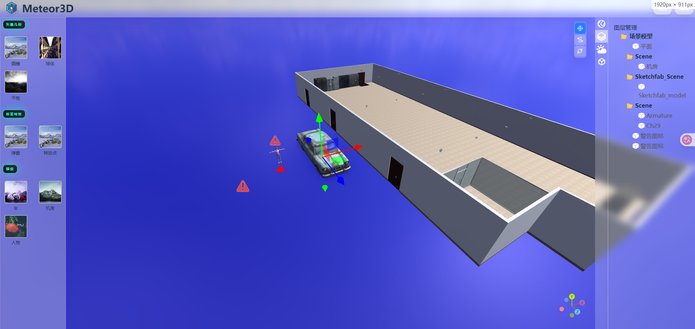
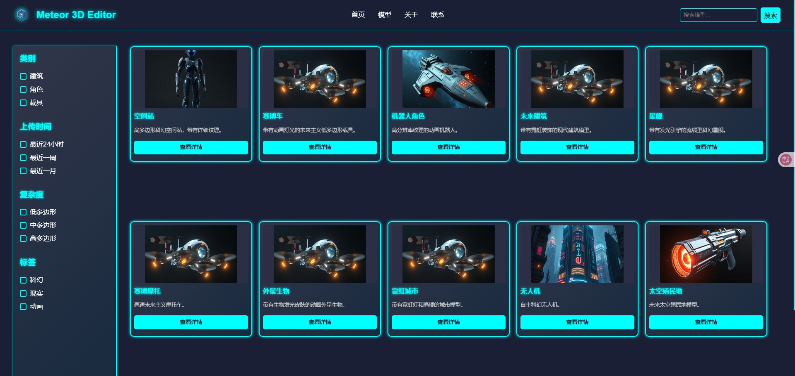

#  Meteor3D Editor - 数字孪生场景构建系统

## ✨ 项目简介

**Meteor3D Editor** 是一个基于 Web 的三维孪生场景搭建系统，采用 **Vue 3 + Element Plus + Three.js** 实现，提供可视化拖拽式编辑能力，适用于数字孪生、工业仿真、建筑漫游等场景。

系统主打“所见即所得”的设计理念，通过图形化操作帮助用户快速构建三维可视化场景。

---

## 🖥️ 技术架构

| 技术栈      | 说明                         |
|------------|------------------------------|
| Vue 3      | 现代渐进式 JavaScript 框架   |
| Element Plus | UI 组件库，用于界面快速开发 |
| Three.js   | WebGL 封装库，实现三维渲染   |

---

## 🧩 系统功能模块

### 🔧 左侧资源面板

左侧为可拖拽的模型资源菜单，包括：

- **基础几何体**：圆柱、球体、平板等；
- **标签元素**：弹窗、特效标记等；
- **自定义模型**：如汽车、机房、人物等；
- 拖动任意资源元素可直接添加至场景中。

📷 示例截图：

---

### 🏗️ 中央场景编辑器

- 基于 Three.js 实现真实 3D 编辑环境；
- 支持模型的平移、旋转、缩放；
- 拖拽元素后立即可视化呈现；
- 支持模型之间的组合嵌套、层级控制；
- 内置基础物理光照与阴影效果。

---

### 📋 右侧属性与图层管理器

- **天气系统控制**：环境光、天色、背景贴图等；
- **对象属性面板**：选中模型后可编辑其位置、大小、材质属性；
- **图层组管理**：清晰组织场景结构，可展开/收起模型层级树；
- 支持模型命名、锁定、隐藏等操作。

📷 示例截图：

---

### 📁 模型资源库系统

- 内建 3D 模型资源库；
- 支持分类筛选（角色、建筑、载具等）；
- 支持按上传时间、面数复杂度、标签等筛选；
- 每个模型提供预览与“添加到场景”功能。

📷 示例截图：

---

## 🔍 特性亮点

- ✅ 全流程图形化操作，零代码建模；
- ✅ 模型、标签一键拖入场景；
- ✅ 支持多种模型格式（gltf、fbx等）；
- ✅ 可拓展资源库，支持上传与分享；
- ✅ 支持数字孪生场景的快速原型搭建；

---

## 📦 应用场景

- 智慧城市可视化
- 数字工厂建模
- 三维仿真教学
- 虚拟展厅/数字孪生展馆
- 建筑漫游演示

---

## 📈 后续功能规划

- ✅ 路径漫游与动画编辑
- ✅ 场景状态保存与导出
- ✅ 物理碰撞与角色导航控制
- ✅ 与 IoT/实时数据对接

---

## 🧑‍💻 开发者说明

本系统源码采用模块化架构设计，未来计划支持插件机制，方便扩展更多交互组件及三方模型引擎接入。

---

## 📬 联系方式

如需合作或部署私有版本，请联系：

- 📧 邮箱：84675738@qq.com
- 🌐 官网：正在建设中...

---

> Meteor3D Editor，助你用浏览器轻松构建专业 3D 世界 🌍
