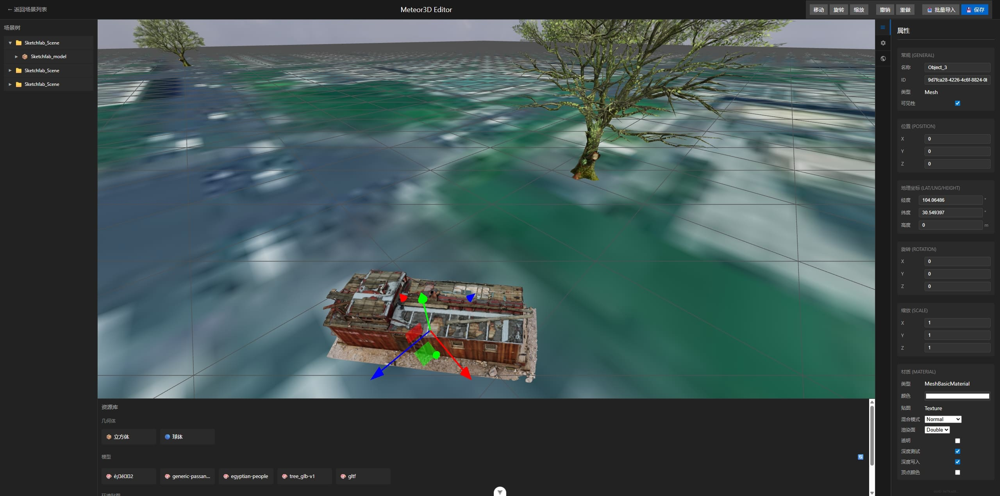
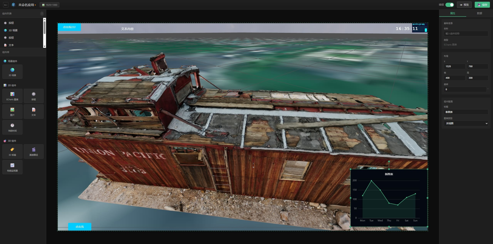

# Meteor3D

<p align="center">
  <strong>🚀 低代码 3D 场景可视化编辑平台</strong>
</p>

<p align="center">
  <a href="https://www.meteor3d.cn" target="_blank">🌐 官网演示</a> •
  <a href="#功能特性">功能特性</a> •
  <a href="#快速开始">快速开始</a> •
  <a href="#技术栈">技术栈</a> •
  <a href="#项目结构">项目结构</a> •
  <a href="#许可证">许可证</a>
</p>

> ⚠️ **注意**：官方演示服务器为 1M 带宽小型服务器，首次加载 3D 模型可能较慢，请耐心等待。

---

## ✨ 功能特性

### 🎨 场景编辑器 (Scene Editor)
- **可视化 3D 场景搭建** - 拖拽式操作，所见即所得
- **模型属性编辑** - 位置、旋转、缩放实时调整
- **场景树管理** - 层级结构清晰，便于管理复杂场景
- **GIS 投影支持** - 经纬度坐标系统，适配数字孪生场景
- **卫星影像底图** - 自动加载瓦片地图，构建真实地理环境

<p align="center">
  
</p>

### 📦 资产管理器 (Asset Manager)
- **3D 模型上传** - 支持 GLTF/GLB 格式
- **自动缩略图生成** - 基于 Three.js 的智能预览
- **模型优化处理** - 自动生成 LOD 和 Draco 压缩版本
- **分类筛选** - 快速定位所需资产

### 🔧 Core SDK
- **开箱即用** - 独立可用的 3D 渲染核心
- **场景序列化** - 支持保存和加载场景数据
- **GIS 坐标转换** - WGS84 与本地坐标系互转
- **性能监控** - 内置 FPS、三角面数统计

### 🌟 应用编辑器 (App Editor) `内测中`

> **拖拽搭建 3D 数据可视化大屏，零代码交付！**

<p align="center">
  
  
</p>

- 🎯 **可视化画布** - 自定义分辨率，适配各类大屏
- 🔗 **组件交互** - 按钮点击触发场景切换、数据联动
- 📊 **数据面板** - ECharts 图表、3D 标签实时渲染
- 🚀 **一键预览** - 所见即所得，秒级部署上线

<p align="center">
  
</p>

---

## 🚀 快速开始

### 环境要求

- Node.js >= 16
- pnpm >= 8

### 安装

```bash
# 克隆仓库
git clone https://github.com/nikonikoCW/Meteor3DEditor.git
cd Meteor3DEditor

# 安装依赖
pnpm install
```

### 启动开发服务

```bash
# 启动场景编辑器 (端口 5173)
pnpm dev:scene

# 启动资产管理器 (端口 5175)
pnpm dev:asset

# 启动后端服务 (端口 3001)
cd meteor3d-server && npm run dev
```

---

## 🛠️ 技术栈

### 前端

| 技术 | 版本 | 用途 |
|------|------|------|
| Vue 3 | ^3.5 | 前端框架 (Composition API) |
| Three.js | ^0.181 | 3D 渲染引擎 |
| Vite | ^7.2 | 构建工具 |
| Pinia | ^3.0 | 状态管理 |

### 后端

| 技术 | 用途 |
|------|------|
| Node.js + Express | Web 服务 |
| MongoDB + Mongoose | 数据存储 |
| Multer | 文件上传 |

---

## 📂 项目结构

```
Meteor3D/
├── packages/
│   ├── core/                # @meteor3d/core 核心 SDK
│   │   ├── SceneManager.js      # 场景管理器
│   │   ├── PersistenceManager.js # 持久化管理
│   │   └── GisProjection.js     # GIS 投影
│   │
│   ├── scene-editor/        # 3D 场景编辑器
│   │   ├── components/          # Vue 组件
│   │   ├── views/               # 页面视图
│   │   └── services/            # API 服务
│   │
│   └── asset-manager/       # 资产管理器
│
└── meteor3d-server/         # 后端服务
    ├── models/                  # 数据模型
    ├── controllers/             # 控制器
    └── routes/                  # 路由
```

---

## 🎯 使用场景

- **智慧城市** - GIS 融合的城市三维可视化
- **数字孪生** - 工厂、园区的数字化呈现
- **可视化大屏** - 数据驾驶舱与 3D 场景结合
- **虚拟展厅** - 在线产品展示与虚拟漫游

---

## 📄 许可证

本项目基于 [MIT License](LICENSE) 开源。

---

## 🤝 贡献

欢迎提交 Issue 和 Pull Request！

1. Fork 本仓库
2. 创建功能分支 (`git checkout -b feature/amazing-feature`)
3. 提交更改 (`git commit -m 'Add amazing feature'`)
4. 推送分支 (`git push origin feature/amazing-feature`)
5. 创建 Pull Request

---

<p align="center">
  Made with ❤️ by <a href="https://github.com/nikonikoCW">nikonikoCW</a>
</p>
