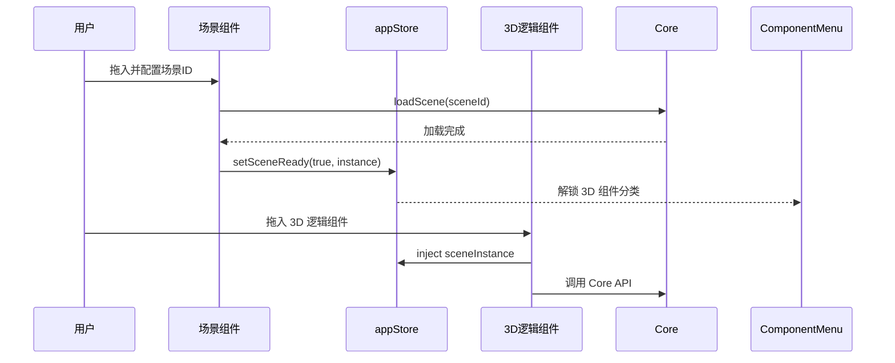

# App Editor 包说明

> 本文档旨在帮助 AI 编程助手快速理解 `@meteor3d/app-editor` 项目的结构和功能。

## 项目概述

`app-editor` 是 Meteor3D 低代码平台的**应用编辑器**模块。它允许用户通过拖拽组件的方式，快速搭建包含 3D 场景、图表、按钮等元素的交互式 Web 应用。

---

## 核心架构

### 分层设计

```
┌─────────────────────────────────────────────────────────────┐
│                    @meteor3d/core (原子能力层)               │
│     loadScene() / enableStats() / createLabel() ...        │
└──────────────────────────┬──────────────────────────────────┘
                           │ 调用
                           ▼
┌─────────────────────────────────────────────────────────────┐
│                 App Editor (业务组装层)                      │
│  ┌─────────────┐  ┌─────────────┐  ┌─────────────────────┐  │
│  │ 场景组件     │  │  2D 组件    │  │     3D 逻辑组件      │  │
│  │ (Container) │  │   (UI)      │  │    (Headless)       │  │
│  └─────────────┘  └─────────────┘  └─────────────────────┘  │
└─────────────────────────────────────────────────────────────┘
```

### 组件三分类

| 类型 | 角色 | 特点 | 右侧面板 |
|------|------|------|----------|
| **场景组件** | 容器 | 渲染 3D Canvas，初始化 Core SDK | 属性栏 |
| **2D 组件** | UI 交互 | 可见元素 (按钮/图表/文本) | 属性栏 + 数据栏 + 交互栏 |
| **3D 逻辑组件** | 业务逻辑 | 无 UI，对 Core API 的声明式封装 | 数据栏 + 交互栏 |

### `enabled` 状态语义

所有组件都有 `enabled` 属性，语义统一：

| 组件类型 | enabled = true | enabled = false |
|----------|---------------|-----------------|
| 2D 组件 | 显示 UI | 隐藏 UI |
| 3D 逻辑组件 | 执行业务逻辑 | 停止 + 清理 |

---

## 技术栈

| 类别 | 技术 |
|------|------|
| 框架 | Vue 3 (Composition API + `<script setup>`) |
| 状态管理 | Pinia |
| 画布交互 | vue3-moveable |
| 图表 | ECharts |
| 3D 引擎 | `@meteor3d/core` |
| 构建工具 | Vite 7 |

---

## 项目结构

```
src/
├── core/
│   └── widgetRegistry.js      # 组件注册表
├── stores/
│   └── appStore.js            # 状态管理 + 交互触发
├── components/
│   ├── canvas/
│   │   └── AppCanvas.vue      # 画布 (UI组件/3D逻辑组件分离渲染)
│   ├── left/
│   │   └── ComponentMenu.vue  # 组件库 (3D 分类场景就绪后解锁)
│   ├── right/
│   │   ├── PropertyPanel.vue  # 属性面板
│   │   ├── DataPanel.vue      # 数据面板
│   │   └── InteractionPanel.vue # 交互面板 (enable/disable/toggle)
│   └── widgets/
│       ├── SceneWidget.vue    # 场景组件 (provide Core 实例)
│       ├── StatsWidget.vue    # 性能监视器 (3D 逻辑组件)
│       ├── ButtonWidget.vue   # 按钮 (2D)
│       └── ...
└── views/
    └── AppEditorView.vue      # 编辑器主视图
```

---

## 核心运转逻辑

### 1. 场景加载与 3D 组件依赖



**约束**：3D 逻辑组件只能在场景加载完成后添加（组件库灰显禁用状态）

### 2. 交互系统

```
Button (2D)              StatsWidget (3D)
   │                          │
   │ click 事件               │
   ▼                          │
InteractionPanel              │
   │ 配置规则:                 │
   │ target: StatsWidget      │
   │ action: enable           │
   ▼                          │
appStore.triggerEvent()       │
   │                          │
   └──► enabled = true ───────┘
             │
             ▼
        Core.enableStats()
```

### 3. 3D 逻辑组件模式

3D 逻辑组件是对 Core API 的**声明式封装**：

```javascript
// StatsWidget.vue
watch(() => props.enabled, (isEnabled) => {
  if (isEnabled) {
    getCoreInstance().enableStats();
  } else {
    getCoreInstance().disableStats();
  }
});
```

---

## 数据持久化

### Widget 数据结构

```javascript
{
  id: 'uuid',
  type: 'Stats',           // 组件类型
  position: { x, y },      // 位置 (2D 组件)
  size: { width, height }, // 尺寸 (2D 组件)
  rotation: 0,             // 旋转角度
  enabled: true,           // 启用状态
  data: {},                // 组件配置数据
  interactions: [{         // 交互规则
    event: 'click',
    target: 'widget-id',
    action: 'toggle'       // enable | disable | toggle
  }]
}
```

### 后端 API

| 方法 | 路径 | 说明 |
|------|------|------|
| GET | `/api/app/list` | 应用列表 |
| GET | `/api/app/:id` | 应用详情 |
| POST | `/api/app` | 创建应用 |
| PUT | `/api/app/:id` | 更新应用 |
| DELETE | `/api/app/:id` | 删除应用 |

---

## 扩展指南

### 添加新的 3D 逻辑组件

1. **创建组件文件** `src/components/widgets/NewWidget.vue`

```vue
<template>
  <!-- 3D 逻辑组件无 UI -->
  <div v-if="false"></div>
</template>

<script setup>
import { inject, watch, onMounted, onBeforeUnmount } from 'vue';
import { useAppStore } from '../../stores/appStore';

const props = defineProps({
  enabled: { type: Boolean, default: true },
  data: { type: Object, default: () => ({}) }
});

const appStore = useAppStore();

// 获取 Core 实例
const getCoreInstance = () => appStore.sceneInstance;

// 监听 enabled 变化
watch(() => props.enabled, (isEnabled) => {
  if (isEnabled) {
    // 调用 Core API
  } else {
    // 清理逻辑
  }
});

onMounted(() => {
  if (props.enabled) {
    // 初始化
  }
});

onBeforeUnmount(() => {
  // 清理
});
</script>
```

2. **注册组件** `widgetRegistry.js`

```javascript
registerWidget('NewLogic', {
  label: '新逻辑组件',
  icon: '🔧',
  category: '3d',  // 重要：分类为 3d
  defaultSize: { width: 150, height: 80 },
  props: [],
  actions: [
    { name: 'enable', label: '启用' },
    { name: 'disable', label: '禁用' }
  ]
}, () => import('../components/widgets/NewWidget.vue'));
```

---

## 开发命令

```bash
# 开发模式
pnpm dev:app

# 构建
pnpm --filter @meteor3d/app-editor build
```

---

## 已实现功能

- [x] 拖拽式组件编排
- [x] Moveable 交互 (拖拽/缩放/旋转)
- [x] 编辑/预览模式
- [x] 属性面板编辑
- [x] 应用保存/加载
- [x] 2D 组件 (ECharts/图片/文本/时钟/按钮)
- [x] 3D 场景嵌入 (SceneWidget)
- [x] 3D 逻辑组件框架 (StatsWidget)
- [x] 交互系统 (enable/disable/toggle)
- [x] 场景就绪约束 (3D 组件依赖场景)

## 待实现功能

- [ ] 3D 标签组件 (LabelWidget)
- [ ] 漫游路径组件 (TourWidget)
- [ ] 数据面板 (数据源配置)
- [ ] 组件层级管理 (z-index)
- [ ] 撤销/重做
