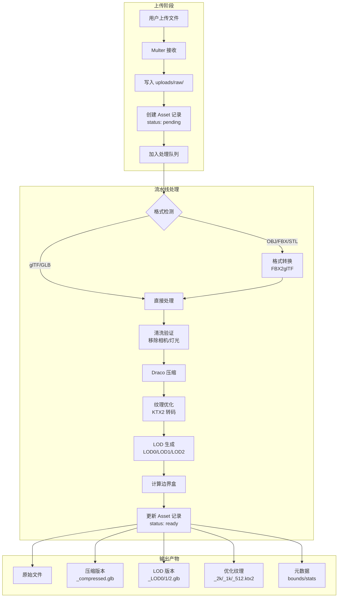

# 资产处理流水线 (Asset Processing Pipeline)

> 一次处理，到处使用 — 将原始 3D 资产转换为 Web 优化格式

## 项目背景

当前 `meteor3d-server` 的资产上传功能较为简单，用户上传文件后直接存储，无任何预处理。本规划将实现一套完整的**资产处理流水线**，在服务端自动完成格式转换、压缩优化、LOD 生成等工作。

---

## User Review Required

> [!IMPORTANT]
> **技术选型需确认**：本方案依赖多个外部 CLI 工具，需要在服务器环境预装。请确认部署环境是否支持：
> - Node.js 子进程调用 CLI 工具
> - 至少 4GB 内存用于模型处理

> [!WARNING]  
> **Breaking Changes**：
> 1. `Asset` 数据模型将新增多个字段，需要迁移现有数据
> 2. 上传 API 响应结构会变化，前端需要适配

---

## 技术选型

### 核心工具链

| 功能 | 工具 | 说明 |
|------|------|------|
| 格式转换 | [gltf-transform](https://gltf-transform.dev/) | 支持 OBJ/FBX/STL → glTF，已有 CLI |
| Draco 压缩 | gltf-transform draco | 内置 Draco 压缩支持 |
| 纹理转换 | [KTX-Software](https://github.com/KhronosGroup/KTX-Software) | PNG/JPG → KTX2/Basis |
| LOD 生成 | [gltf-transform simplify](https://gltf-transform.dev/modules/functions/functions/simplify) | 基于 meshoptimizer 的网格简化 |
| FBX 支持 | [FBX2glTF](https://github.com/facebookincubator/FBX2glTF) | FBX → glTF 转换 |

### npm 依赖

```json
{
  "@gltf-transform/core": "^4.x",
  "@gltf-transform/extensions": "^4.x", 
  "@gltf-transform/functions": "^4.x",
  "draco3dgltf": "^1.x",
  "meshoptimizer": "^0.x",
  "sharp": "^0.33.x",
  "bull": "^4.x"
}
```

---

## 架构设计



---

## Proposed Changes

### Component 1: 数据模型扩展

#### [MODIFY] [Asset.js](file:///f:/chenwei/Projects/Meteor3D/meteor3d-server/src/models/Asset.js)

扩展 Asset Schema，新增处理状态和输出文件字段：

```javascript
const AssetSchema = new mongoose.Schema({
    // ... 现有字段保持不变 ...
    
    // 新增：处理状态
    processingStatus: {
        type: String,
        enum: ['pending', 'processing', 'ready', 'failed'],
        default: 'pending'
    },
    processingError: String,
    
    // 新增：处理后的输出文件
    processedFiles: {
        compressed: String,      // chair_compressed.glb
        lod0: String,            // chair_LOD0.glb (高精度)
        lod1: String,            // chair_LOD1.glb (中等)
        lod2: String,            // chair_LOD2.glb (低精度)
        textures: {
            original: String,
            '2k': String,
            '1k': String,
            '512': String
        }
    },
    
    // 新增：预计算边界数据
    bounds: {
        box: {
            min: { x: Number, y: Number, z: Number },
            max: { x: Number, y: Number, z: Number }
        },
        sphere: {
            center: { x: Number, y: Number, z: Number },
            radius: Number
        }
    },
    
    // 新增：模型统计信息
    stats: {
        triangleCount: Number,
        vertexCount: Number,
        materialCount: Number,
        textureCount: Number
    }
});
```

---

### Component 2: 处理流水线核心

#### [NEW] [pipeline/](file:///f:/chenwei/Projects/Meteor3D/meteor3d-server/src/pipeline/)

新建流水线模块目录，包含以下文件：

```
src/pipeline/
├── index.js              # 流水线入口
├── queue.js              # Bull 任务队列配置
├── processors/
│   ├── formatConverter.js    # 格式转换 (OBJ/FBX/STL → glTF)
│   ├── sanitizer.js          # 清洗验证 (移除相机/灯光)
│   ├── dracoCompressor.js    # Draco 压缩
│   ├── textureOptimizer.js   # 纹理优化 (KTX2 转码 + 多分辨率)
│   ├── lodGenerator.js       # LOD 生成
│   └── boundsCalculator.js   # 边界盒计算
└── utils/
    └── gltfUtils.js          # glTF 操作工具函数
```

---

#### [NEW] [queue.js](file:///f:/chenwei/Projects/Meteor3D/meteor3d-server/src/pipeline/queue.js)

使用 Bull 实现任务队列，支持异步处理：

```javascript
const Queue = require('bull');

const assetQueue = new Queue('asset-processing', {
    redis: { host: 'localhost', port: 6379 },
    defaultJobOptions: {
        attempts: 3,
        backoff: { type: 'exponential', delay: 1000 }
    }
});

module.exports = assetQueue;
```

---

#### [NEW] [index.js](file:///f:/chenwei/Projects/Meteor3D/meteor3d-server/src/pipeline/index.js)

流水线主入口，编排各处理步骤：

```javascript
const { convertFormat } = require('./processors/formatConverter');
const { sanitize } = require('./processors/sanitizer');
const { compressDraco } = require('./processors/dracoCompressor');
const { optimizeTextures } = require('./processors/textureOptimizer');
const { generateLODs } = require('./processors/lodGenerator');
const { calculateBounds } = require('./processors/boundsCalculator');

async function processAsset(asset) {
    const context = { assetId: asset._id, inputPath: asset.filePath };
    
    // Step 1: 格式转换
    context.gltfPath = await convertFormat(context);
    
    // Step 2: 清洗验证
    await sanitize(context);
    
    // Step 3: Draco 压缩
    context.compressedPath = await compressDraco(context);
    
    // Step 4: 纹理优化
    context.textures = await optimizeTextures(context);
    
    // Step 5: LOD 生成
    context.lods = await generateLODs(context);
    
    // Step 6: 边界盒计算
    context.bounds = await calculateBounds(context);
    
    return context;
}

module.exports = { processAsset };
```

---

#### [NEW] [formatConverter.js](file:///f:/chenwei/Projects/Meteor3D/meteor3d-server/src/pipeline/processors/formatConverter.js)

格式转换处理器：

```javascript
const { exec } = require('child_process');
const path = require('path');

async function convertFormat(context) {
    const ext = path.extname(context.inputPath).toLowerCase();
    
    // glTF/GLB 无需转换
    if (['.gltf', '.glb'].includes(ext)) {
        return context.inputPath;
    }
    
    // FBX 使用 FBX2glTF
    if (ext === '.fbx') {
        const outputPath = context.inputPath.replace(ext, '.glb');
        await execPromise(`FBX2glTF -i "${context.inputPath}" -o "${outputPath}"`);
        return outputPath;
    }
    
    // OBJ/STL 使用 gltf-transform
    // ...
}
```

---

#### [NEW] [dracoCompressor.js](file:///f:/chenwei/Projects/Meteor3D/meteor3d-server/src/pipeline/processors/dracoCompressor.js)

Draco 压缩处理器：

```javascript
const { Document, NodeIO } = require('@gltf-transform/core');
const { draco } = require('@gltf-transform/functions');
const draco3d = require('draco3dgltf');

async function compressDraco(context) {
    const io = new NodeIO().registerExtensions(/* ... */);
    const document = await io.read(context.gltfPath);
    
    await document.transform(
        draco({ 
            quantizePosition: 14,
            quantizeNormal: 10,
            quantizeTexcoord: 12
        })
    );
    
    const outputPath = context.gltfPath.replace('.glb', '_compressed.glb');
    await io.write(outputPath, document);
    
    return outputPath;
}
```

---

#### [NEW] [textureOptimizer.js](file:///f:/chenwei/Projects/Meteor3D/meteor3d-server/src/pipeline/processors/textureOptimizer.js)

纹理优化处理器：

```javascript
const sharp = require('sharp');
const { exec } = require('child_process');

async function optimizeTextures(context) {
    // 1. 提取纹理
    const textures = extractTexturesFromGLTF(context.gltfPath);
    
    const results = {};
    for (const tex of textures) {
        // 2. 生成多分辨率版本
        results[tex.name] = {
            '2k': await resizeTexture(tex.path, 2048),
            '1k': await resizeTexture(tex.path, 1024),
            '512': await resizeTexture(tex.path, 512)
        };
        
        // 3. 转换为 KTX2 格式
        for (const [size, path] of Object.entries(results[tex.name])) {
            await convertToKTX2(path);
        }
    }
    
    return results;
}
```

---

#### [NEW] [lodGenerator.js](file:///f:/chenwei/Projects/Meteor3D/meteor3d-server/src/pipeline/processors/lodGenerator.js)

LOD 生成处理器：

```javascript
const { simplify } = require('@gltf-transform/functions');
const { MeshoptSimplifier } = require('meshoptimizer');

const LOD_RATIOS = [1.0, 0.5, 0.25]; // LOD0: 100%, LOD1: 50%, LOD2: 25%

async function generateLODs(context) {
    await MeshoptSimplifier.ready;
    
    const lods = [];
    for (let i = 0; i < LOD_RATIOS.length; i++) {
        const document = await io.read(context.compressedPath);
        
        await document.transform(
            simplify({ simplifier: MeshoptSimplifier, ratio: LOD_RATIOS[i] })
        );
        
        const lodPath = context.compressedPath.replace('.glb', `_LOD${i}.glb`);
        await io.write(lodPath, document);
        lods.push(lodPath);
    }
    
    return lods;
}
```

---

#### [NEW] [boundsCalculator.js](file:///f:/chenwei/Projects/Meteor3D/meteor3d-server/src/pipeline/processors/boundsCalculator.js)

边界盒计算处理器：

```javascript
async function calculateBounds(context) {
    const document = await io.read(context.gltfPath);
    
    let minX = Infinity, minY = Infinity, minZ = Infinity;
    let maxX = -Infinity, maxY = -Infinity, maxZ = -Infinity;
    
    // 遍历所有 mesh 的顶点
    for (const mesh of document.getRoot().listMeshes()) {
        for (const prim of mesh.listPrimitives()) {
            const positions = prim.getAttribute('POSITION');
            // ... 计算边界
        }
    }
    
    // 计算包围球
    const center = { 
        x: (minX + maxX) / 2, 
        y: (minY + maxY) / 2, 
        z: (minZ + maxZ) / 2 
    };
    const radius = Math.sqrt(
        Math.pow(maxX - center.x, 2) + 
        Math.pow(maxY - center.y, 2) + 
        Math.pow(maxZ - center.z, 2)
    );
    
    return {
        box: { min: { x: minX, y: minY, z: minZ }, max: { x: maxX, y: maxY, z: maxZ } },
        sphere: { center, radius }
    };
}
```

---

### Component 3: 控制器与路由更新

#### [MODIFY] [assetController.js](file:///f:/chenwei/Projects/Meteor3D/meteor3d-server/src/controllers/assetController.js)

更新上传逻辑，加入队列：

```javascript
const assetQueue = require('../pipeline/queue');

exports.uploadAsset = async (req, res) => {
    // ... 现有逻辑 ...
    
    // 加入处理队列
    await assetQueue.add('process', { assetId: asset._id });
    
    res.status(201).json({
        success: true,
        message: '文件上传成功，正在处理中...',
        asset: asset
    });
};

// 新增：获取处理状态
exports.getProcessingStatus = async (req, res) => {
    const asset = await Asset.findById(req.params.id).select('processingStatus processingError');
    res.json({ success: true, ...asset.toObject() });
};
```

---

#### [MODIFY] [assetRoutes.js](file:///f:/chenwei/Projects/Meteor3D/meteor3d-server/src/routes/assetRoutes.js)

新增路由：

```javascript
// GET /api/assets/:id/status - 获取处理状态
router.get('/:id/status', assetController.getProcessingStatus);

// GET /api/assets/:id/processed - 获取处理后的文件列表
router.get('/:id/processed', assetController.getProcessedFiles);
```

---

### Component 4: 上传配置更新

#### [MODIFY] [upload.js](file:///f:/chenwei/Projects/Meteor3D/meteor3d-server/src/config/upload.js)

扩展支持的格式：

```javascript
const allowedFormats = [
    // 现有格式
    '.gltf', '.glb', '.jpg', '.jpeg', '.png', '.hdr', '.exr',
    // 新增格式
    '.obj', '.fbx', '.stl'
];
```

新增目录结构：

```
uploads/
├── raw/          # 原始上传文件
├── processed/    # 处理后的文件
│   ├── models/       # 压缩后的模型
│   ├── lods/         # LOD 版本
│   └── textures/     # 优化后的纹理
├── thumbnails/   # 缩略图
└── temp/         # 临时处理目录
```

---

### Component 5: 前端资产管理器适配

#### [MODIFY] [assetService.js](file:///f:/chenwei/Projects/Meteor3D/packages/asset-manager/src/services/assetService.js)

新增 API 调用：

```javascript
// 获取处理状态
export async function getProcessingStatus(assetId) {
    const response = await fetch(`${API_BASE}/assets/${assetId}/status`);
    return response.json();
}

// 轮询等待处理完成
export async function waitForProcessing(assetId, interval = 2000) {
    return new Promise((resolve, reject) => {
        const check = async () => {
            const { processingStatus, processingError } = await getProcessingStatus(assetId);
            if (processingStatus === 'ready') resolve();
            else if (processingStatus === 'failed') reject(new Error(processingError));
            else setTimeout(check, interval);
        };
        check();
    });
}
```

---

#### [MODIFY] [AssetsView.vue](file:///f:/chenwei/Projects/Meteor3D/packages/asset-manager/src/views/AssetsView.vue)

UI 更新：

1. 上传后显示处理进度
2. 列表中显示处理状态标签（pending/processing/ready/failed）
3. 处理完成后显示可用的 LOD 版本切换

---

## 依赖安装

### 后端 npm 依赖

```bash
cd meteor3d-server
npm install @gltf-transform/core @gltf-transform/extensions @gltf-transform/functions
npm install draco3dgltf meshoptimizer sharp bull
```

### 系统工具

| 工具 | 安装命令 | 说明 |
|------|----------|------|
| Redis | `docker run -p 6379:6379 redis` | Bull 队列依赖 |
| FBX2glTF | 下载 [Release](https://github.com/facebookincubator/FBX2glTF/releases) | FBX 转换 |
| KTX-Software | 下载 [Release](https://github.com/KhronosGroup/KTX-Software/releases) | KTX2 转换 |

---

## Verification Plan

### Automated Tests

由于项目当前没有测试框架，建议新增 Jest 测试：

```bash
# 安装测试依赖
cd meteor3d-server
npm install --save-dev jest

# 运行测试
npm test
```

计划编写测试：

1. **单元测试**：每个处理器的独立测试
   - `formatConverter.test.js`
   - `dracoCompressor.test.js`
   - `boundsCalculator.test.js`

2. **集成测试**：端到端流水线测试
   - 上传 OBJ 文件 → 验证输出 GLB
   - 上传 FBX 文件 → 验证 Draco 压缩效果
   - 验证 LOD 生成的文件数量和大小

### Manual Verification

1. **基础流程验证**：

```bash
# 1. 启动 Redis
docker run -d -p 6379:6379 redis

# 2. 启动后端服务
cd meteor3d-server && npm run dev

# 3. 使用 curl 上传测试文件
curl -X POST http://localhost:3001/api/assets/upload \
  -F "file=@test-model.fbx"

# 4. 检查处理状态
curl http://localhost:3001/api/assets/{assetId}/status

# 5. 验证输出文件
ls -la uploads/processed/
```

2. **前端 UI 验证**：
   - 启动资产管理器 (`pnpm dev:asset`)
   - 上传一个 FBX 模型
   - 观察上传列表中的处理状态变化
   - 处理完成后查看是否有 LOD 切换选项

3. **场景编辑器集成验证**：
   - 启动场景编辑器 (`pnpm dev:scene`)
   - 从资产库拖入处理后的模型
   - 验证 Draco 解压是否正常
   - 验证边界盒数据是否正确显示

---

## 实施阶段

| 阶段 | 内容 | 预估时间 |
|------|------|----------|
| 1 | 数据模型扩展 + 目录结构 | 0.5h |
| 2 | Bull 队列配置 | 0.5h |
| 3 | 格式转换处理器 | 1h |
| 4 | Draco 压缩处理器 | 1h |
| 5 | 纹理优化处理器 | 1.5h |
| 6 | LOD 生成处理器 | 1h |
| 7 | 边界盒计算处理器 | 0.5h |
| 8 | 控制器/路由更新 | 0.5h |
| 9 | 前端适配 | 1h |
| 10 | 测试与调试 | 2h |

**总计：约 9.5 小时**

---

## 注意事项

1. **内存管理**：大模型处理可能消耗大量内存，需要考虑分片处理或增加服务器配置
2. **错误处理**：每个处理步骤需要完善的错误捕获和日志记录
3. **断点续传**：处理失败后应支持从失败步骤重试
4. **并发控制**：Bull 队列需要限制并发数，避免资源耗尽
