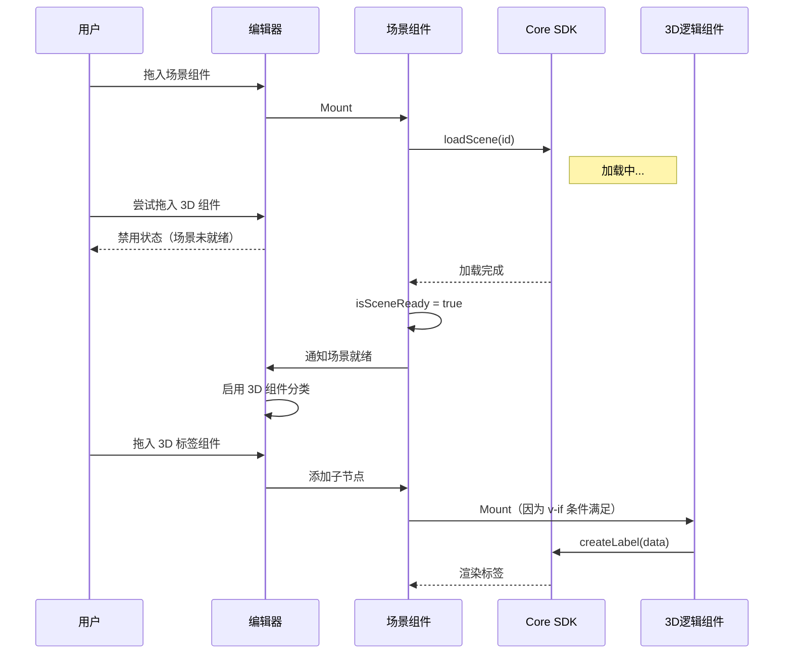

# App 编辑器架构设计方案

## 1. 核心分层架构

### 1.1 @core (原子能力层)
- **定位**：纯技术实现的 SDK，不包含特定业务逻辑。
- **职责**：
  - 封装 Three.js 底层逻辑。
  - 提供通用的 CRUD API（如 `createLabel`, `updateLabel`, `removeLabel`, `createLine` 等）。
  - **生命周期管理**：负责场景加载状态的维护，对外暴露标准事件（供 SDK 独立使用场景）。
- **接口要求**：所有 3D 对象操作需包含完整生命周期方法：`create`, `update`, `remove`。

### 1.2 @app-editor (业务组装层)
- **定位**：可视化搭建平台，实现数据驱动视图。
- **职责**：组件管理、状态分发、逻辑编排。

---

## 2. 组件体系分类

App 编辑器内组件分为三大类：

### 2.1 场景组件 (Container)
- **角色**：舞台/容器，是所有 3D 逻辑组件的**必要前置条件**。
- **功能**：
  - 渲染 3D Canvas。
  - 初始化 `@core` 的 `SceneManager`。
  - **Context 提供者**：通过 `provide` 向子组件暴露 Core 实例。
  - **条件渲染**：只有在场景加载完成后，才渲染内部的 3D 子组件。
- **配置**：场景 ID、服务器地址。

### 2.2 2D 组件 (UI)
- **角色**：界面交互。
- **例子**：Echarts 图表、按钮、文本框、列表。
- **面板配置**：
  - **属性栏**：UI 样式、位置。
  - **数据栏**：静态数据或 API 数据源。
  - **交互栏**：触发事件（如点击按钮 -> 触发 3D 组件启用）。

### 2.3 3D 组件 (Logic/Headless)
- **角色**：逻辑控制器 / 副作用容器。
- **定义**：**无 UI 的纯逻辑组件**（在组件树可见，画布上不可见或仅显示占位符）。
- **本质**：对 Core API 的**声明式封装**。
- **约束**：**必须作为场景组件的子节点存在**。
- **面板配置**：
  - **数据栏**：核心参数（坐标 `x,y,z`、样式配置）。应支持**"从场景拾取坐标"**功能。
  - **交互栏**：暴露回调（如 `onCreated`, `onClick`）。
  - **无属性栏**：不涉及传统 UI 样式。

---

## 3. 3D 组件核心逻辑设计

### 3.1 双状态模型 (Active/Inactive)
3D 组件对外简化为两个核心状态，内部通过 Vue Watcher 自动管理生命周期。

| 状态 | 行为 | 对应 Core 动作 |
| :--- | :--- | :--- |
| **启用 (Active)** | 组件挂载 / 激活 | `core.createXxx(config)` |
| **运行中 (Update)** | 属性/数据变更 | `core.updateXxx(id, newConfig)` |
| **停止 (Inactive)** | 组件卸载 / 停用 | `core.removeXxx(id)` |

### 3.2 生命周期保证策略 (业务约束模式)

**核心思想**：通过业务层面的约束消除竞态问题，而不是在代码中处理复杂的异步逻辑。

#### 编辑态约束
1.  **组件可用性**：
    - 左侧组件列表中，3D 组件分类在 **没有场景组件** 或 **场景未加载完成** 时显示为 **灰色/禁用**。
    - 鼠标悬停提示："请先添加场景组件并选择场景"。
2.  **组件树层级**：
    - 3D 逻辑组件只能拖拽为场景组件的 **子节点**。
    - 拖拽到其他位置无效或自动移动到场景组件下。

#### 运行态保证
1.  **场景组件职责**：
    - 初始化 Core SDK 并加载场景。
    - 维护 `isSceneReady` 状态。
    - **只有在 `isSceneReady === true` 时，才渲染其子组件（3D 组件）**。
2.  **结果**：
    - 3D 组件的 `onMounted` 被调用时，场景 **必然已经就绪**。
    - 3D 组件可以直接调用 Core API，无需等待或检查状态。

### 3.3 架构时序图

---

## 4. 详细实施计划

### 阶段一：Core SDK 增强 (Groundwork) ✅ 已完成
目标：使 Core 具备完备的生命周期管理和事件能力。
1.  **事件总线实现**
    - [x] 在 `SceneManager` 中添加 `events` 属性（EventEmitter）。
    - [x] 实现 `on`, `emit`, `off` 方法。
2.  **生命周期状态**
    - [x] 添加 `isReady` 状态标识。
    - [x] 在 `loadScene` 完成时 `emit('scene-ready')`。
3.  **API 标准化**
    - [x] 完善 `LabelManager.js` 的 CRUD（基于 ID 的 create/update/remove）。

### 阶段二：App Editor 基础架构 (Infrastructure)
目标：搭建 Vue 组件与 Core 的桥梁，实现业务约束。
1.  **场景组件改造**
    - [ ] 创建 `SceneWidget.vue`。
    - [ ] 实现 Core 实例初始化与场景加载。
    - [ ] 使用 `provide` 注入 `sceneContext`（Core 实例）。
    - [ ] 实现条件渲染：`v-if="isSceneReady"` 包裹子组件插槽。
2.  **编辑器约束逻辑**
    - [ ] 左侧组件列表：监听场景就绪状态，动态禁用 3D 组件分类。
    - [ ] 组件树拖拽：限制 3D 组件只能作为场景组件子节点。
3.  **Store 状态管理**
    - [ ] 在 `appStore` 中添加 `hasSceneWidget` 和 `isSceneReady` 状态。

### 阶段三：组件与交互实现 (Implementation)
目标：落地具体的业务组件。
1.  **3D 标签组件**
    - [ ] 创建 `LabelWidget.vue`（3D 逻辑组件）。
    - [ ] 对接 Core 的 Label API。
    - [ ] 实现右侧数据面板配置（坐标、内容、样式）。
2.  **坐标拾取器 (Picker)**
    - [ ] 在 3D 组件的数据面板中增加"拾取坐标"按钮。
    - [ ] 实现：点击按钮 -> 场景进入拾取模式 -> 点击场景 -> 返回坐标 -> 退出模式。
3.  **交互验证**
    - [ ] 创建一个 Button 组件（2D）。
    - [ ] 配置交互：Button Click -> Toggle Label Widget Active。
    - [ ] 验证：标签是否能正确显示和消失。
